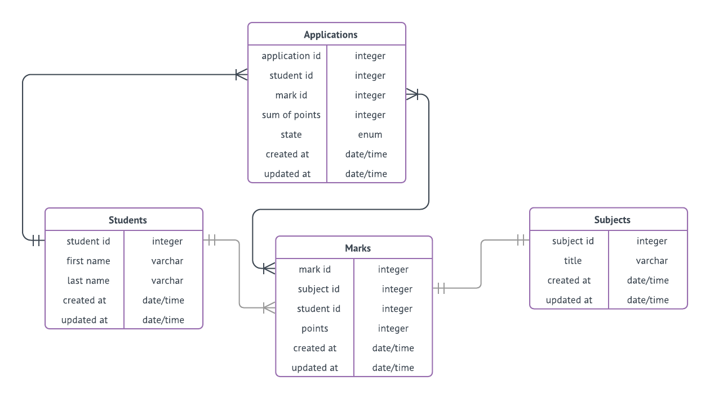

# Data Model
Entity Relationship Diagram with SQL commands to apply them to database.




```sql
CREATE TABLE `Applications` (
  `application id` integer,
  `student id` integer,
  `mark id` integer,
  `sum of points` integer,
  `state` enum('draft', 'sent', 'rejected', 'completed', 'accepted', 'unaccepted'),
  `created at` date/time,
  `updated at` date/time
);

CREATE TABLE `Students` (
  `student id` integer,
  `first name` varchar,
  `last name` varchar,
  `created at` date/time,
  `updated at` date/time
);

CREATE TABLE `Subjects` (
  `subject id` integer,
  `title` varchar,
  `created at` date/time,
  `updated at` date/time
);

CREATE TABLE `Marks` (
  `mark id` integer,
  `subject id` integer,
  `student id` integer,
  `points` integer,
  `created at` date/time,
  `updated at` date/time
);

```

Created with [lucidchart.com](https://lucidchart.com/)